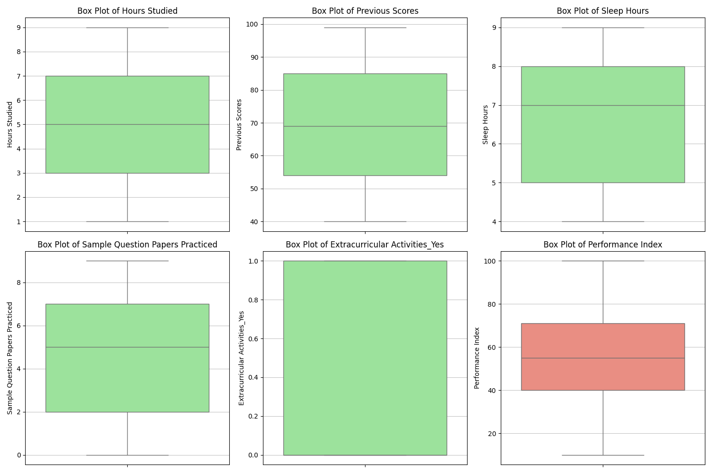

# Student Performance Prediction

This repository contains an exploratory data analysis (EDA) and a predictive model for student performance, aiming to identify key factors influencing a student's "Performance Index."

## Implementation Details

This predictive model for student performance is implemented using a **hand-written linear regression algorithm**. This means the core mechanics of the linear regression, including the cost function and gradient descent, were built from scratch rather than relying on pre-built libraries like scikit-learn for the regression model itself. This approach provides a deeper understanding of the algorithm's internal workings.

---

## Exploratory Data Analysis (EDA)

Our EDA focused on understanding the distributions of various features and their relationships with the `Performance Index`.

### 1. Feature Distributions (Histograms & Box Plots)

* **Histograms**: Show that `Hours Studied`, `Sleep Hours`, and `Sample Question Papers Practiced` have relatively uniform distributions across their respective ranges. `Previous Scores` exhibits a more normal-like distribution. The `Performance Index` itself is well-distributed, resembling a normal (bell-shaped) curve, which is favorable for regression tasks.

  

* **Box Plots**: Confirm the central tendencies and spread of the numerical features. They also indicate a general absence of extreme outliers in the dataset, suggesting clean data.

    

### 2. Feature Influence (Scatter Plots & Pair Plot)

The scatter plots of individual features against `Performance Index` and the overall pair plot were crucial for identifying influential predictors.

* **Features vs. Performance Index**:

    * **`Previous Scores` vs. `Performance Index`**: Displays a **very strong, clear positive linear correlation**. As `Previous Scores` increase, `Performance Index` consistently rises. This is the most influential numerical feature.

    * **`Hours Studied` vs. `Performance Index`**: Shows a **strong positive correlation**. While discrete, a clear upward trend is visible; more hours studied generally lead to a higher `Performance Index`.

    * **`Extracurricular Activities_Yes` vs. `Performance Index`**: The plot shows a noticeable difference in `Performance Index` distribution between students who participate (`1`) and those who don't (`0`). Students with extracurricular activities tend to have a higher `Performance Index`. This indicates it's an important categorical predictor.

    * **`Sleep Hours` & `Sample Question Papers Practiced` vs. `Performance Index`**: These features show no clear linear relationship or trend with the `Performance Index`. Their distributions against the target appear scattered without a discernible pattern.

    

* **Pair Plot**: This comprehensive plot reinforces the above findings. The most striking positive linear relationships are observed between `Previous Scores` and `Performance Index`, and `Hours Studied` and `Performance Index`. Other feature interactions appear weak or non-linear.

  

**Conclusion on Feature Influence:** Based on the EDA, **`Previous Scores`**, **`Hours Studied`**, and **`Extracurricular Activities`** are identified as the most influential features for predicting `Performance Index`.

## Model Training & Performance

A linear regression model was trained to predict the `Performance Index`.

### 1. Cost Curve

The "iterations vs cost" curve illustrates the model's learning process during training.

* The `cost` (likely Mean Squared Error or similar loss function) starts high and rapidly decreases within the first ~150-200 iterations.

* After this initial steep drop, the cost flatters out and remains consistently low, indicating that the model has converged and learned the underlying patterns effectively. This is a healthy sign of successful training.

    

### 2. Actual vs. Predicted on Test Set

This scatter plot compares the model's `Predicted Performance Index` against the `Actual Performance Index` on the unseen test set.

* The **red dashed line** represents the "Perfect Prediction Line" ($y=x$), where predicted values exactly match actual values.

* The **scattered blue points** represent our model's predictions. The points are tightly clustered around the perfect prediction line, indicating a **high degree of accuracy**.

* The narrow band of scatter around the red line suggests that the model's predictions are consistently close to the true values, demonstrating strong generalization ability on new data.

    

**Overall Model Performance:** The combination of a converging cost curve and the tight clustering of predictions around the perfect line on the test set suggests that the model is performing **very well** in predicting student performance based on the selected features.