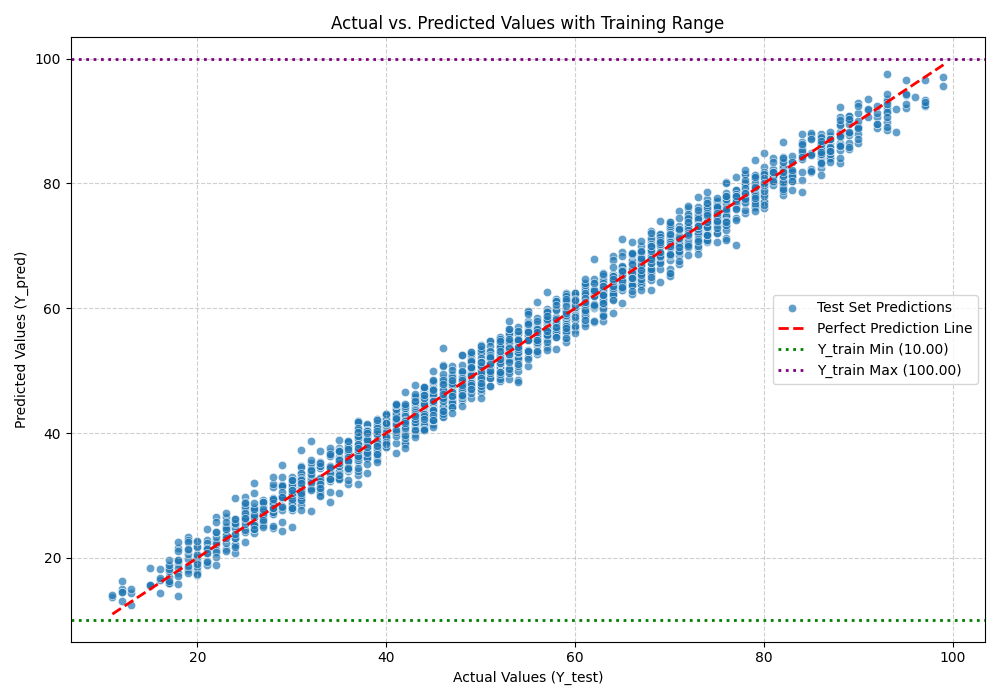
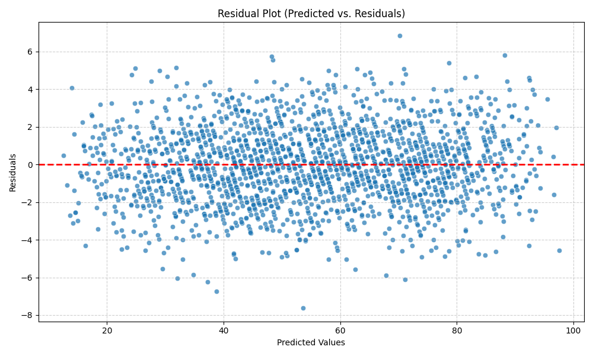

# Student Performance Prediction: Linear Regression Model Summary

This repository summarizes a Linear Regression model built using `scikit-learn` to predict student performance scores, which range from 10 to 100. This README explains the model's approach, its results, and provides visual evidence to justify why it's a reasonable and effective predictive tool.

## 1. Problem Statement & Features

The goal is to predict a student's performance score. The model utilizes all five available features from the dataset:

* `Hours Studied` (Numerical)
* `Previous Scores` (Numerical)
* `Extracurricular Activities` (Categorical: 'Yes'/'No')
* `Sleep Hours` (Numerical)
* `Sample Question Papers Practiced` (Numerical)

## 2. Model Approach: Scikit-learn Linear Regression Pipeline

The model is constructed using a `scikit-learn` pipeline, which streamlines the process of data preprocessing and model training.

### Key Steps:

1.  **Feature Preprocessing**:
    * **Numerical Features**: `Hours Studied`, `Previous Scores`, `Sleep Hours`, and `Sample Question Papers Practiced` are scaled using `StandardScaler`. This ensures all numerical features contribute equally to the model, preventing features with larger scales from dominating the learning process.
    * **Categorical Features**: `Extracurricular Activities` (a 'Yes'/'No' categorical variable) is transformed using `OneHotEncoder`. This converts the categories into numerical binary (0 or 1) features (`Extracurricular Activities_no` and `Extracurricular Activities_yes`), making them suitable for linear regression.
    * A `ColumnTransformer` efficiently applies these different transformations to the correct columns.
2.  **Linear Regression**: After preprocessing, the transformed features are fed into a `LinearRegression` model, which learns the linear relationship to predict student performance scores.

## 3. Model Results

The trained `scikit-learn` Linear Regression model yielded the following key metrics and parameters:

* **Mean Squared Error (MSE)**: `4.08`
* **Coefficients** (weights learned for each transformed feature):
    * `Hours Studied`: `7.40134079`
    * `Previous Scores`: `17.63727127`
    * `Extracurricular Activities_no`: `0.81003107`
    * `Extracurricular Activities_yes`: `0.54884171`
    * `Sleep Hours`: `-0.30430834`
    * `Sample Question Papers Practiced`: `0.30430834`
* **Intercept (Bias)**: `55.31477131465273`

## 4. Why This is a Reasonable Model

The model's performance and characteristics suggest it is a reasonable and effective predictor of student performance:

### a. Low Mean Squared Error (MSE)

An MSE of `4.08` is quite good given that the student performance scores range from 10 to 100 (a range of 90 points).

* To better interpret this, we can look at the **Root Mean Squared Error (RMSE)**: $\sqrt{4.08} \approx 2.02$.
* This means, on average, the model's predictions are off by approximately **2.02 performance points**.
* An average error of just 2 points on a 90-point scale is very small, indicating high predictive accuracy. For instance, if a student's actual score is 75, the model's prediction would typically fall between 73 and 77. This level of precision is generally sufficient for practical applications in evaluating student performance.

### b. Visual Confirmation of Performance

The following plots provide strong visual evidence of the model's quality:

#### Actual vs. Predicted Values
This plot shows the actual performance scores against the model's predicted scores. The data points cluster very tightly around the red dashed "Perfect Prediction Line" ($y=x$). This close alignment visually confirms that the model's predictions are highly accurate and follow the true underlying trend.

#### Residual Plot
The residual plot displays the errors (residuals) against the predicted values. A key indicator of a good linear model is that residuals are randomly scattered around the horizontal line at zero, with no discernible patterns (e.g., no U-shape, no fanning out). As seen in the plot, the residuals exhibit this desired random scatter, implying that the model has successfully captured the systematic relationships in the data, and the remaining errors are simply random noise.

#### Distribution of Residuals
This histogram illustrates the frequency distribution of the residuals. The distribution closely approximates a normal (bell-shaped) distribution centered around zero. This is a crucial finding because it confirms a key assumption of Ordinary Least Squares (OLS) linear regression: that the errors are normally distributed. This indicates that the model's errors are random and unbiased, and that the statistical inferences derived from the model (e.g., significance of coefficients) are likely valid.

### c. Interpretable Coefficients

The coefficients provide insight into the influence of each feature on the predicted performance score. Since numerical features were scaled, their coefficients can be compared to understand their relative impact. For example, `Previous Scores` has the largest positive coefficient (`17.64`), indicating it's a very strong predictor. The categorical `Extracurricular Activities` also contributes, and the `Sleep Hours` feature has a small negative impact. These coefficients align with intuitive understanding of factors affecting student performance.

In conclusion, based on its low MSE, strong visual fit, randomly distributed and normally distributed residuals, and interpretable coefficients, this `scikit-learn` Linear Regression model is a reasonable and effective solution for predicting student performance.